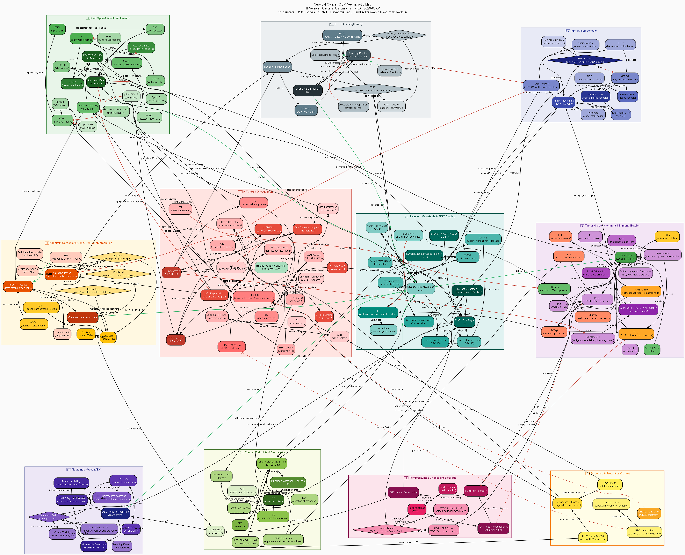

# Cervical Cancer QSP Model

> **Category**: Gynecologic Oncology | **Abbreviation**: CC | **Date**: 2026-07-01

[](cc_qsp_model_en.svg)

---

## Disease Overview

Cervical cancer ranks fourth among cancers in women worldwide, with approximately 660,000 diagnoses and 350,000 deaths annually (GLOBOCAN 2020). Virtually all cases arise from persistent infection with **high-risk human papillomavirus (High-risk HPV, particularly HPV16/18)**, and the disease has the following pathophysiological features:

- **HPV E6/E7 oncogenes**: E6 degrades p53 via the ubiquitin-proteasome pathway mediated by E6AP, abolishing the G1 checkpoint, while E7 binds pRb and releases E2F, driving the cell cycle out of control.
- **Viral genome integration**: integration from the episomal state into the host genome results in loss of the E2 repressor, causing E6/E7 overexpression.
- **CIN progression continuum**: progresses through CIN1 (mild) → CIN2 (moderate) → CIN3/CIS (severe/carcinoma in situ) to invasive cancer that breaches the basement membrane, with p16INK4a overexpression used as a surrogate marker.
- **Preventable through screening**: a prime example of a preventable cancer, whose incidence can be dramatically reduced through Pap smear/HPV co-testing and HPV vaccination.
- **Stage distribution at diagnosis**: in regions with inadequate screening, diagnosis often occurs at a locally advanced stage (FIGO IB3-IVA), making concurrent chemoradiotherapy (CCRT) the cornerstone of standard treatment.

### Shift in Treatment Paradigm

Since GOG-240 (Tewari, NEJM) demonstrated the survival benefit of bevacizumab in recurrent/metastatic disease in 2014, KEYNOTE-826 (Colombo, NEJM) incorporated pembrolizumab into first-line treatment for PD-L1 CPS≥1 disease in 2021, and KEYNOTE-A18 (Lorusso, Lancet) fundamentally changed the standard-of-care paradigm in 2024 by adding pembrolizumab to concurrent chemoradiotherapy for high-risk locally advanced disease. In second-line-or-later recurrent/metastatic disease, the tissue-factor-targeted antibody-drug conjugate **tisotumab vedotin** (innovaTV 204/301) has established itself as a new treatment axis.

---

## The 11 Key Mechanistic Subsystems

| # | Cluster | Key components |
|---|---------|------------|
| **1** | **HPV oncogenic pathway** | HPV16/18 E6/E7, E6AP, p53 degradation, pRb-E2F axis, viral integration, CIN1/2/3, p16INK4a, telomerase |
| **2** | **Cell cycle/proliferation/apoptosis evasion** | Cyclin E/D1, CDK2/4/6, p21, p27, PIK3CA, AKT/mTOR, BCL-2/BAX, Survivin, caspases |
| **3** | **Tumour microenvironment/immune evasion** | PD-L1/PD-1, CD8+T, Treg, MDSC, TAM, IDO1, MHC-I downregulation (E7-mediated), T-cell exhaustion |
| **4** | **Angiogenesis** | HIF-1α, VEGF-A, VEGFR1/2, tumour hypoxia, bevacizumab |
| **5** | **Invasion/metastasis/staging** | EMT, MMP-2/9, lymphovascular space invasion (LVSI), pelvic/para-aortic lymph nodes, FIGO 2018 staging |
| **6** | **Platinum-based concurrent chemoradiotherapy PK/PD** | Cisplatin (weekly 40mg/m²), platinum-DNA adducts, NER, radiosensitisation |
| **7** | **Radiotherapy** | EBRT+brachytherapy, LQ model (α/β=10Gy), TCP, reoxygenation, accelerated repopulation |
| **8** | **Immune checkpoint inhibitor PK/PD** | Pembrolizumab, PD-1 receptor occupancy, T-cell reactivation, CPS score |
| **9** | **Antibody-drug conjugate PK/PD** | Tisotumab vedotin, tissue factor (TF) targeting, MMAE release, microtubule disruption, bystander killing |
| **10** | **Clinical endpoints/biomarkers** | SCC-Ag, HPV viral load, RECIST 1.1, PFS, OS, pathological complete response |
| **11** | **Screening/prevention (context)** | HPV vaccine, Pap/HPV co-testing, colposcopy, LEEP/conisation |

---

## 19-Compartment ODE Model

| # | Compartment (symbol) | Description |
|---|-----------|------|
| 1 | `CIS_C1` | Cisplatin central compartment |
| 2 | `CIS_C2` | Cisplatin peripheral compartment |
| 3 | `PAC_C1` | Paclitaxel central compartment (intermittent chemotherapy for recurrent/metastatic disease) |
| 4 | `PAC_C2` | Paclitaxel peripheral compartment |
| 5 | `BEV_C1` | Bevacizumab central compartment |
| 6 | `BEV_C2` | Bevacizumab peripheral compartment |
| 7 | `PEMBRO_C1` | Pembrolizumab central compartment |
| 8 | `PEMBRO_C2` | Pembrolizumab peripheral compartment |
| 9 | `TV_ADC_C1` | Tisotumab vedotin (ADC) central compartment |
| 10 | `TV_ADC_C2` | Tisotumab vedotin (ADC) peripheral compartment |
| 11 | `MMAE_free` | Free intratumoural MMAE payload (relative value) |
| 12 | `VEGF` | Free VEGF-A concentration (ng/mL) |
| 13 | `Pt_DNA` | Platinum-DNA adducts (relative value, 0-1) |
| 14 | `RT_SF` | Cumulative radiation damage (LQ model, relative value) |
| 15 | `TV` | Tumour volume (cm³, Gompertz model) |
| 16 | `SCCAg` | Serum SCC-Ag (ng/mL) |
| 17 | `HPVload` | HPV viral load (relative log10 copies) |
| 18 | `CD8T` | CD8+ T cells (relative value) |
| 19 | `PDL1_exp` | Tumour PD-L1 expression (relative value, CPS-like) |

---

## Six Treatment Scenarios — 2-Year Simulation

| # | Scenario | Drug/radiation | Supporting trial | Indication |
|---|---------|------|------------|--------|
| **S1** | Untreated | — | Natural history | — |
| **S2** | Cisplatin concurrent chemoradiotherapy (CCRT) | Cisplatin 40mg/m² weekly×6 + EBRT/brachytherapy | **RTOG-90-01** (Morris 1999/Eifel 2004 NEJM/JCO) | Locally advanced standard |
| **S3** | CCRT + pembrolizumab (concurrent+maintenance) | +Pembro 200mg q3w | **KEYNOTE-A18** (Lorusso 2024 Lancet) | High-risk locally advanced |
| **S4** | Platinum+paclitaxel+bevacizumab | Cis/Carbo+Pacli+Bev 15mg/kg q3w | **GOG-240** (Tewari 2014 NEJM) | First-line recurrent/metastatic |
| **S5** | Tisotumab vedotin alone | TV-ADC 2.0mg/kg q3w | **innovaTV 301** (Vergote 2024 NEJM) | Second-line-or-later recurrent/metastatic |
| **S6** | Platinum+paclitaxel+bevacizumab+pembrolizumab | 4-drug combination | **KEYNOTE-826** (Colombo 2021 NEJM) | First-line recurrent/metastatic, CPS≥1 |

---

## Key Parameter Calibration

| Parameter | Value | Source |
|---------|-----|------|
| Cisplatin standard dose | 40mg/m² weekly IV ×5-6 (concurrent CCRT) | Rose 1999 NEJM (GOG-120) |
| Cisplatin CL | ~30 L/h (total platinum basis) | Reece 1987 J Clin Oncol |
| Radiation LQ α/β | 10 Gy (cervical squamous cell carcinoma) | Fowler 1989 Br J Radiol |
| EBRT + brachytherapy total dose | EQD2 ≥85Gy (HR-CTV) | Pötter 2018/2021 (EMBRACE-I/II) |
| Bevacizumab t½ | ~20 days (IgG1) | Lu 2008 Cancer Chemother Pharmacol |
| Pembrolizumab t½ | ~22 days, linear PK | Ahamadi 2017 CPT:PSP |
| Tisotumab vedotin dose | 2.0mg/kg q3w IV | Coleman 2021 Lancet Oncol (innovaTV 204) |
| SCC-Ag t½ | ~2.8 days | Gaarenstroom 2000 Int J Gynecol Cancer |
| RTOG-90-01 result | OS advantage with concurrent chemoradiotherapy | Eifel 2004 J Clin Oncol |
| GOG-240 mOS | 16.8 vs 13.3 months (HR 0.71) | Tewari 2014 NEJM |
| KEYNOTE-826 result | Improved mOS, greatest benefit in CPS≥1 group | Colombo 2021 NEJM |
| KEYNOTE-A18 mPFS | HR 0.70 (high-risk locally advanced) | Lorusso 2024 Lancet |
| innovaTV 301 mOS | 11.5 vs 9.5 months (HR 0.70) | Vergote 2024 NEJM |

---

## Shiny App Tab Layout

| Tab | Content |
|----|------|
| **① Patient profile** | FIGO stage, PD-L1 CPS status, baseline SCC-Ag, CCRT status, treatment-eligibility matrix |
| **② Drug PK** | Time-concentration curves for cisplatin, paclitaxel, pembrolizumab, tisotumab vedotin, bevacizumab |
| **③ PD key indicators** | Platinum-DNA adducts, cumulative radiation damage (LQ), CD8+ T cells, tumour PD-L1 expression |
| **④ Clinical endpoints** | Tumour volume Gompertz curve, RECIST classification, best response %, estimated PFS |
| **⑤ Scenario comparison** | Comparison of tumour/SCC-Ag across 6 treatment scenarios, summary table |
| **⑥ Biomarkers** | 6-panel composite biomarker view, stage-specific treatment algorithm, reference values from clinical trials |

---

## QSP Model Files

| Component | File | Specification |
|---------|------|------|
| 🗺️ Mechanistic map (DOT) | [`cc_qsp_model_en.dot`](cc_qsp_model_en.dot) | **150+ nodes, 11 clusters** (fdp layout) |
| 🖼️ Mechanistic map (SVG) | [`cc_qsp_model_en.svg`](cc_qsp_model_en.svg) | Vector image |
| 🖼️ Mechanistic map (PNG) | [`cc_qsp_model_en.png`](cc_qsp_model_en.png) | 150 dpi raster image |
| ⚙️ mrgsolve ODE model | [`cc_mrgsolve_model.R`](cc_mrgsolve_model.R) | **19-compartment ODE**, **6 treatment scenarios**, calibrated to RTOG-90-01/GOG-240/KEYNOTE-A18/826/innovaTV 301 |
| 📊 Shiny dashboard | [`cc_shiny_app_en.R`](cc_shiny_app_en.R) | **6-tab** interactive dashboard |
| 📚 References | [`cc_references_en.md`](cc_references_en.md) | **63 PubMed citations** (15 sections) |

---

## How to Run the Shiny App

```r
# Install required packages
install.packages(c("shiny", "shinydashboard", "mrgsolve", "dplyr",
                   "ggplot2", "tidyr", "DT", "plotly", "patchwork"))

# Run the app
shiny::runApp("cervical-cancer/cc_shiny_app.R")
```

---

*Cervical Cancer QSP Model | Cervical Cancer (HPV-driven) QSP | 2026-07-01 | Claude Code Routine*
