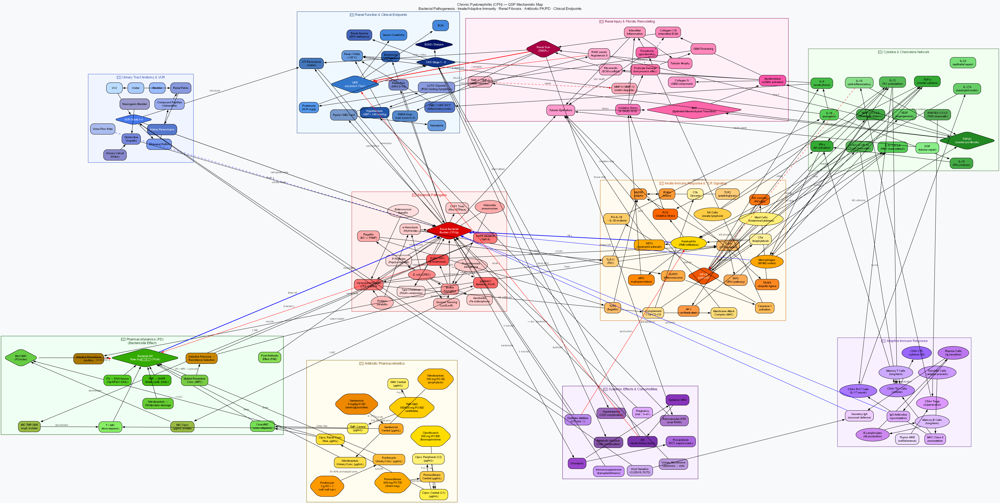

# Chronic Pyelonephritis — QSP Model

> **Category**: Chronic disease / Renal-urinary tract
> **Date**: 2026-06-20
> **Abbreviation**: CPN

---

## Overview

Chronic pyelonephritis is a chronic kidney disease in which **recurrent upper urinary tract bacterial infection** or **vesicoureteral reflux (VUR)** produces permanent scarring of the renal parenchyma and calyces. It can ultimately progress to chronic kidney disease (CKD).

| Item | Content |
|------|------|
| Main causative organisms | *E. coli* (UPEC, 75%), *Klebsiella*, *Proteus*, *Pseudomonas* |
| Pathogenesis | VUR → bacterial reflux → TLR4/NFκB activation → inflammation → TGF-β1 → fibrosis → renal scarring |
| Main risk factors | VUR, diabetes, immunosuppression, pregnancy, urinary tract obstruction, neurogenic bladder |
| Clinical features | High fever, flank pain, pyuria/hematuria, chronic hypertension, proteinuria, reduced GFR |
| Recurrence rate | ~50% recurrence at 5 years (in patients with risk factors) |

---

## Key Pathophysiological Pathways

| Pathway | Key molecules | Clinical outcome |
|------|----------|----------|
| UPEC adhesion & invasion | Type I fimbriae (FimH), P fimbriae (PapG), α-hemolysin | Renal pelvis colonisation → renal parenchymal invasion |
| VUR-mediated reflux | Grade I–V VUR, compound papillae | Intrarenal reflux → recurrent infection |
| TLR4/NFκB activation | LPS → TLR4 → MyD88 → IKK → NFκB | Excess production of IL-1β, IL-6, IL-8, TNF-α |
| NLRP3 inflammasome | HlyA → K⁺ efflux → NLRP3 → caspase-1 → IL-1β, pyroptosis | Tubular epithelial necrosis |
| Complement activation | LPS → C3 → C5a, MAC | Cell lysis, neutrophil recruitment |
| EMT & TGF-β1 fibrosis | TGF-β1 → EMT → myofibroblasts → collagen I/III | Renal interstitial fibrosis, reduced DMSA uptake |
| Renin-angiotensin | Scar → RAAS activation → Ang II → TGF-β1 | Secondary hypertension, reduced GFR |

---

## Antibiotic PK/PD Parameters

| Antibiotic | Regimen | Bioavailability | t₁/₂ | PK/PD index | Clinical target |
|-------|------|----------|------|------------|----------|
| Ciprofloxacin | 500 mg PO BID | 70% | ~4 h | fAUC/MIC | > 125 |
| TMP-SMX | 160/800 mg PO BID | 95% / 85% | ~10 h | T>MIC | > 40% |
| Nitrofurantoin (prophylaxis) | 100 mg PO QD | 75% | 0.3–1 h | urinary Cmax/MIC | > 4× |
| Fosfomycin | 3 g PO single dose | ~40% (urinary) | 4–8 h | Cmax/MIC (urinary) | > 8× |
| Gentamicin (severe) | 5 mg/kg IV QD | — (IV) | ~2 h | Cmax/MIC | > 10 |

---

## Model File List

| File | Description |
|------|------|
| [`cpn_qsp_model_en.dot`](cpn_qsp_model_en.dot) | Graphviz mechanistic map source (10 clusters, 140+ nodes) |
| [`cpn_qsp_model_en.svg`](cpn_qsp_model_en.svg) | SVG vector image (scalable) |
| [`cpn_qsp_model_en.png`](cpn_qsp_model_en.png) | PNG raster image (150 dpi) |
| [`cpn_mrgsolve_model_en.R`](cpn_mrgsolve_model_en.R) | mrgsolve ODE model (18 compartments, 7 scenarios) |
| [`cpn_shiny_app_en.R`](cpn_shiny_app_en.R) | Shiny dashboard (7 tabs: patient/PK/bacteria/renal function/scenarios/biomarkers/references) |
| [`cpn_references_en.md`](cpn_references_en.md) | 38 references (with PubMed links) |

---

## mrgsolve ODE Compartment Structure (18 compartments)

```
PK  : Cipro_gut → Cipro_C ↔ Cipro_P → [renal conc.]
      TMP_gut   → TMP_C
      NIT_gut   → NIT_urine

Disease :
  Bacteria   (log₁₀ CFU/g)       — bacterial burden (growth/death/immunity)
  Biofilm    (0–1)                — biofilm fraction
  Neutrophil (normalised)        — neutrophils (acute inflammation)
  Macrophage (normalised)        — macrophages (chronic inflammation)
  IL6        (normalised)        — cytokine (acute phase)
  TGFb1      (normalised)        — fibrosis driver
  Collagen   (normalised)        — interstitial collagen
  RenalScar  (0–1)               — renal scarring (irreversible)
  GFR        (mL/min/1.73m²)     — glomerular filtration rate
```

---

## Treatment Scenarios (7)

| # | Scenario | Outcome summary |
|---|---------|----------|
| S1 | No treatment (no antibiotics) | Persistent bacterial burden → rapid GFR decline, scar formation |
| S2 | Ciprofloxacin 500 mg BID × 14 days | Bacterial clearance within 7–10 days, GFR preserved |
| S3 | TMP-SMX 160/800 mg BID × 14 days | Effect similar to S2 in susceptible strains |
| S4 | Ciprofloxacin 500 mg BID × 7 days | Slightly reduced efficacy vs 14 days, lower resistance selection pressure |
| S5 | Nitrofurantoin 100 mg QD × 6 months prophylaxis | 60% reduction in recurrence, preserves GFR |
| S6 | Cipro 14 days → nitrofurantoin 6 months | Best GFR preservation and scar suppression |
| S7 | TMP-SMX + resistant organism (MIC × 4) | Treatment-failure simulation → persistent bacteria, rapid fibrosis |

---

## Mechanistic Map Preview

[](cpn_qsp_model_en.svg)

*Click to view the scalable SVG.*

---

## Shiny App Tab Structure (7 Tabs)

| Tab | Content |
|----|------|
| ① Patient profile | GFR, VUR grade, comorbidities, antibiotic selection |
| ② PK monitoring | Cipro/TMP/NIT plasma concentrations, fAUC/MIC |
| ③ Bacterial dynamics | log₁₀ CFU, biofilm, kill rate, immune cells |
| ④ Renal function (GFR) | GFR trend, creatinine, scarring, CKD stage transition |
| ⑤ Scenario comparison | Simultaneous comparison of 5 antibiotic strategies |
| ⑥ Biomarkers | IL-6, TGF-β1, collagen, urosepsis risk |
| ⑦ References | PubMed links classified by section |
