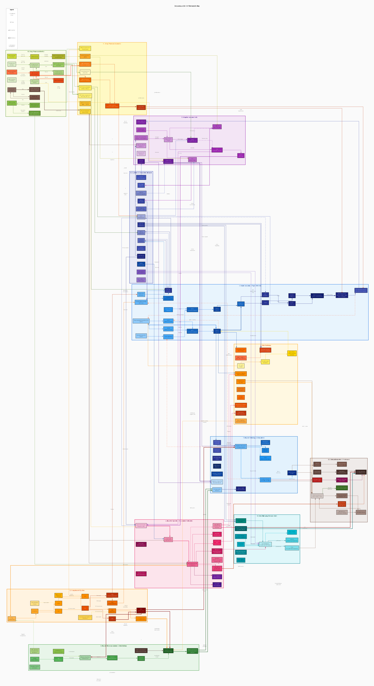

# Dermatomyositis (DM) — QSP Model

> **QSP Disease Model Library** · A Quantitative Systems Pharmacology (QSP) model auto-generated by Claude Code Routine.
> Parent library → [../README_en.md](../README_en.md) · Category: Autoimmune/Rheumatologic

[](dm_qsp_model_en.svg)

## Overview

Dermatomyositis (DM) is an inflammatory autoimmune disease of muscle and skin driven by the type I interferon (IFN) pathway and the complement system, with an annual incidence in adults of roughly 5–10 per million. It presents with proximal muscle weakness and characteristic skin rashes (heliotrope rash, Gottron's papules), and complement-mediated injury to muscle microvasculature is the core pathophysiology. The main drug targets are IFN-α/β signalling, B-cell-mediated autoantibody production, CD8+ T-cell activation, and the complement pathway; steroids, IVIG, rituximab, and JAK inhibitors are the representative treatments.

## Key Pathophysiological Pathways

| Pathway | Key molecules/mechanism | Clinical outcome |
|------|----------------|-----------|
| Type I IFN signalling | pDC-derived IFN-α/β → overexpression of MxA, IFIT | Elevated IFN score, persistent muscle injury |
| Complement-mediated vasculopathy | C3b/MAC formation → injury to muscle microvascular endothelium | Capillary loss, muscle fibre ischaemia |
| B cells/autoantibodies | Production of anti-Jo-1, anti-Mi-2, anti-MDA5 autoantibodies | Drives muscle and lung fibrosis |
| CD8+ T-cell infiltration | Cytotoxic T cells within muscle → direct muscle fibre injury | Elevated CK, reduced muscle strength |
| Th17/Treg imbalance | IL-17 overexpression, reduced Treg | Persistent chronic inflammation |
| JAK-STAT pathway | JAK1/2 → STAT1 activation | Amplified IFN-response gene expression |
| TGF-β fibrosis | Chronic inflammation → TGF-β → muscle/lung fibrosis | Reduced FVC, loss of function |

## Key Drug Targets

- **Corticosteroids** (prednisolone): broad immunosuppression, inhibits the NF-κB pathway
- **IVIG** (intravenous immunoglobulin): complement inhibition, Fc receptor blockade, autoantibody neutralisation
- **Methotrexate (MTX)**: folate antagonism, suppresses T-cell/B-cell proliferation
- **Rituximab (RTX)**: anti-CD20 → B-cell depletion, suppresses autoantibody production
- **JAK inhibitors** (ruxolitinib, baricitinib): inhibit JAK1/2 → block IFN signalling
- **Hydroxychloroquine (HCQ)**: inhibits toll-like receptor signalling, improves skin lesions

## Model Files

| File | Description |
|------|------|
| [dm_qsp_model_en.dot](dm_qsp_model_en.dot) | Graphviz mechanistic map source (~175 nodes / 13 clusters) |
| [dm_qsp_model_en.svg](dm_qsp_model_en.svg) | SVG vector image (scalable) |
| [dm_qsp_model_en.png](dm_qsp_model_en.png) | PNG image (150 dpi) |
| [dm_mrgsolve_model_en.R](dm_mrgsolve_model_en.R) | mrgsolve ODE model (~24 compartments / 5 treatment scenarios) |
| [dm_shiny_app_en.R](dm_shiny_app_en.R) | Shiny dashboard |
| [dm_references_en.md](dm_references_en.md) | References (~57, with PubMed links) |

## mrgsolve Model (ODE Model)

- **Compartment structure**: drug PK compartments (1–3 compartments each for prednisolone, IVIG, MTX, rituximab, and JAK inhibitor) + PD compartments (IFN score, complement, B cells, autoantibodies, muscle injury, CK, MMT8, CDASI, FVC, Treg, Th17, CD8 activation, capillaries)
- **Key treatment scenarios**: ① no treatment (natural course), ② prednisolone alone, ③ prednisolone + IVIG, ④ rituximab + steroid, ⑤ JAK inhibitor + steroid
- **Calibration/evidence base**: drawn from MERI and IMACS core-set clinical data, the Oddis et al. Arthritis Rheum rituximab RCT, the baricitinib phase 2 trial (MyoPath), and other sources

## Shiny Dashboard

Consists of 6 tabs: ① patient profile (demographics, autoantibodies, baseline status), ② PK tab (simulated plasma concentrations for each drug), ③ immune PD tab (trends in IFN score, complement, B cells, autoantibodies), ④ clinical endpoints (MMT8 muscle strength, CK, CDASI skin score, FVC), ⑤ scenario comparison (simultaneous comparison of 5 treatment arms), ⑥ biomarker panel (Treg/Th17 ratio, CD8 activation trend).

## Usage

```r
library(mrgsolve)
mod <- mread("dm_mrgsolve_model_en.R")
out <- mrgsim(mod, end = 365)
plot(out)
# Shiny dashboard:
shiny::runApp("dm_shiny_app_en.R")
```
```bash
# render the mechanistic map
dot -Tsvg dm_qsp_model_en.dot -o dm_qsp_model_en.svg
```

## References

For detailed citations, see [dm_references_en.md](dm_references_en.md) (~57 references).

---
*This model is a qualitative/semi-quantitative QSP model intended for educational and research purposes and cannot be used directly for clinical decision-making.*
