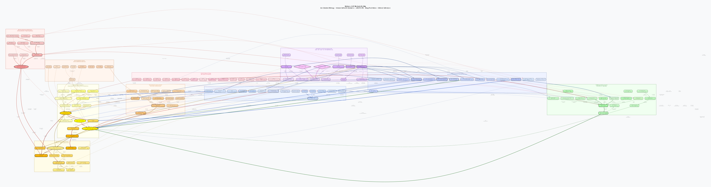

# Epilepsy QSP Model

**Category**: Neurology | Chronic neurological disease  
**Date**: 2026-06-21  
**Version**: 1.0

---

## Overview

Epilepsy is one of the most common chronic neurological diseases, affecting about
50 million people worldwide, and is defined as two or more unprovoked seizures, or one
seizure with a high risk of recurrence over the following 10 years (ILAE 2014). The
incidence of epilepsy in adults is about 50/100,000/year, and worldwide prevalence is
0.5–1%.

This QSP model is an integrated system model that quantitatively links the molecular,
cellular, and network-level pathophysiology of epilepsy to the PK/PD of antiepileptic
drugs (AEDs), mechanisms of drug resistance, and clinical outcomes (seizure frequency,
SUDEP risk, quality of life).

---

## Mechanistic Map

[](epi_qsp_model_en.svg)

**10 subgraph clusters (136 nodes):**

| Cluster | Content |
|---------|------|
| 1. Genetic causes | SCN1A/SCN2A/SCN8A, KCNQ2/3, GABRG2/A1/B3, DEPDC5, TSC1/2, CDKL5, STXBP1, PCDH19 |
| 2. Acquired causes | Mesial temporal sclerosis (MTS), traumatic brain injury, stroke, focal cortical dysplasia (FCD), autoimmune encephalitis |
| 3. Voltage-gated ion channels | Nav1.1/1.2/1.6, Kv7.2/7.3, HCN1/2, T/N-type Ca2+ channels, BK/SK channels |
| 4. GABAergic inhibitory system | GAD65/67, GABA-A (αβγ subunits), GABA-B, PV+/SST+ interneurons |
| 5. Glutamatergic excitatory system | NMDA/AMPA/kainate receptors, mGluR1/2, EAAT1/2 reuptake transporters |
| 6. Seizure network dynamics | Hippocampal CA3→CA1→DG, thalamocortical loop, seizure threshold (Θ), status epilepticus (SE) |
| 7. AED pharmacokinetics | VPA (2 compartments), LEV (1 compartment, renal), CBZ (autoinduction + CBZ-E metabolite), LTG (DDI-sensitive) |
| 8. AED pharmacodynamics | GABA-T inhibition, SV2A binding, Nav blockade, AMPA antagonism, Cav α2δ-1, mTORC1 inhibition |
| 9. Drug-resistance mechanisms | P-gp (ABCB1), MRP2, BCRP, blood-brain-barrier efflux, Nav/GABA-A receptor variants |
| 10. Clinical outcomes | Seizure frequency, ILAE classification, response rate, seizure freedom, SUDEP risk, QoL (QOLIE-89) |

---

## Key Pathophysiological Pathways

### 1. SCN1A gene mutation → Dravet syndrome
```
SCN1A LOF variant
    → loss of Nav1.1 protein function
    → impaired action potential firing in PV+ inhibitory interneurons
    → E/I imbalance (reduced inhibition > increased excitation)
    → reduced seizure threshold → fever-induced seizures → Dravet syndrome
```

### 2. Mesial temporal sclerosis (MTS) → temporal lobe epilepsy (TLE)
```
Loss of hippocampal CA1/CA3 neurons
    → mossy fiber sprouting
    → formation of recurrent CA3 circuits (aberrant circuitry)
    → synchronized burst firing
    → temporal lobe seizure occurrence
```

### 3. GABA-A receptor internalization (SE mechanism)
```
Seizure persisting beyond 5 minutes (established SE)
    → clathrin-mediated internalization of GABA-A receptors
    → reduced postsynaptic GABA-A density
    → reduced BZD responsiveness (fewer receptors)
    → conversion to refractory SE
    → NMDA receptor overactivation → excitotoxic neuronal death
```

### 4. P-gp overexpression → drug-resistant epilepsy (DRE)
```
Recurrent seizures → NF-κB activation
    → increased ABCB1 (MDR1/P-gp) transcription
    → increased blood-brain-barrier AED efflux
    → reduced brain AED exposure
    → treatment failure → DRE criteria met (≥2 AED failures)
```

---

## Summary of drug PK/PD parameters

| Drug | Mechanism of action | Vc (L) | CL (L/h) | t½ | Therapeutic range |
|------|---------|--------|----------|-----|---------|
| VPA | GABA-T inhibition + Nav | 9.1 | 0.47 | 9–17h | 50–100 mcg/mL |
| LEV | SV2A binding | 42 | 3.8 (renal) | 7h | 12–46 mcg/mL |
| CBZ | Slow Nav inactivation | 51 | 3→6.5 (autoinduction) | 8–12→5–8h | 4–12 mcg/mL |
| LTG | State-dependent Nav blockade | 77 | 1.5 (UGT1A4) | 25–36h | 3–14 mcg/mL |
| PHT | Stabilizes Nav inactivation | 50 | nonlinear (Km~4) | 22h | 10–20 mcg/mL |
| GBP | Cav2.2 α2δ-1 | 58 | 6.6 (renal) | 5–7h | 2–20 mcg/mL |

### Key drug-drug interactions (DDI)

| Combination | Mechanism | Clinical impact |
|------|------|---------|
| VPA + LTG | VPA → UGT1A4 inhibition | LTG t½ doubles (24→48h), increased toxicity risk |
| CBZ + LTG | CBZ → CYP3A4 induction | LTG clearance doubles, requires 2x the dose |
| VPA + PHT | VPA → CYP2C9 inhibition | PHT toxicity risk (caution with saturation kinetics) |
| CBZ + oral contraceptives | CBZ → CYP3A4 induction | Increased estrogen clearance → failure risk |

---

## mrgsolve ODE model structure

### Compartments (16)
```
VPA:  AGUT → ACENT ⇌ APER → metabolism
LEV:  BGUT → BCENT → renal excretion
CBZ:  CGUT → CCENT → CMETA (CBZ-E) → excretion
LTG:  DGUT → DCENT → UGT1A4 excretion
PD:   GABA (indirect response) · SYNAP (glutamate) · SV2A_OCC · NAV_BLOCK
Dynamic:  STHRES (seizure threshold) · PGP (P-gp expression)
```

### Indirect response model (GABA, VPA)
```
dGABA/dt = kin × (1 + I_max_VPA) - kout × GABA
where I_max_VPA = Imax × (CNS_VPA^n) / (IC50^n + CNS_VPA^n)
```

### Seizure frequency model
```
SeizFreq(t) = SeizBasal × exp[-k_seiz × (STHRES(t) - STHRES0)]
```

---

## Treatment scenarios (10)

| Scenario | Drug | Dose | Key content |
|---------|------|------|---------|
| 1 | None | — | Baseline seizure frequency (8/month) |
| 2 | VPA | 1,000 mg/day BID | GABA-T inhibition → GABA↑ → threshold↑ |
| 3 | LEV | 3,000 mg/day BID | SV2A binding → reduced synaptic vesicle release |
| 4 | CBZ | 600 mg/day BID | Includes Nav autoinduction, CL↑ after 2-4 weeks |
| 5 | LTG | 200 mg/day BID | Requires slow titration |
| 6 | VPA+LTG | 500/100 mg/day | DDI: LTG t½ doubles → lower LTG dose |
| 7 | CBZ+LTG | 600/400 mg/day | DDI: LTG CL doubles → higher LTG dose required |
| 8 | VPA (DRE) | 1,000 mg/day | P-gp 3-fold → reduced CNS exposure → reduced effect |
| 9 | IV BZD (SE) | Emergency | BZD produces immediate recovery of seizure threshold in early SE |
| 10 | VPA+everolimus | TSC | mTORC1 inhibition → blocks the cortical dysplasia pathway |

---

## Shiny app tab structure

| Tab | Content |
|----|------|
| 1. Patient Profile | Input for age, weight, seizure type, genetics, MRI, history |
| 2. PK Profile | VPA/LEV/CBZ/LTG plasma concentration-time curves (including steady state) |
| 3. PD Biomarkers | GABA level, glutamate, SV2A occupancy, Nav blockade rate |
| 4. Clinical Outcomes | Seizure frequency, response rate, probability of seizure freedom, seizure threshold dynamics |
| 5. Scenario Comparison | Monotherapy vs. combination therapy vs. DRE comparison dashboard |
| 6. Resistance & Risk | P-gp expression trend, blood-brain-barrier exposure ratio, SUDEP risk calculation, mTOR |

---

## File Index

| File | Description |
|------|------|
| [epi_qsp_model_en.dot](epi_qsp_model_en.dot) | Graphviz mechanistic map source (136 nodes, 10 clusters) |
| [epi_qsp_model_en.svg](epi_qsp_model_en.svg) | SVG vector image (zoomable) |
| [epi_qsp_model_en.png](epi_qsp_model_en.png) | PNG raster image (150 dpi) |
| [epi_mrgsolve_model_en.R](epi_mrgsolve_model_en.R) | mrgsolve ODE model (16 compartments, 10 scenarios) |
| [epi_shiny_app_en.R](epi_shiny_app_en.R) | Shiny dashboard (6-tab interactive app) |
| [epi_references_en.md](epi_references_en.md) | 62 references (with PubMed links) |

---

## Key clinical trial evidence

| Drug | Trial | Result |
|------|---------|------|
| LEV | KEEPER (Cereghino 2000) | 26% reduction in seizure frequency, 33% response rate |
| LTG | Matsuo 1993 | 25% reduction in seizure frequency vs. placebo |
| CBZ | Mattson 1985 | Superior in simple partial seizures and GTCS |
| VPA | Chadwick 1999 | Equivalent efficacy to CBZ in generalized seizures |
| Everolimus (TSC) | EXIST-3 (Curatolo 2016) | 41% reduction in seizure frequency |
| Fenfluramine (Dravet) | PHENOMENON 2019 | 71% reduction in seizure frequency |

---

## Technical notes

- The overall model is ODE-based (mrgsolve) plus an indirect-response model for seizure threshold
- CBZ autoinduction is approximated with a Michaelis-Menten saturation function
- P-gp expression follows first-order dynamics driven by seizure burden
- The DDI simulation implements the VPA-LTG and CBZ-LTG interactions
- SUDEP risk uses a semi-quantitative scoring system (presence of nocturnal GTCS, seizure-control status)

---

*Generated by QSP Disease Model Library | Claude Code Routine | 2026-06-21*
