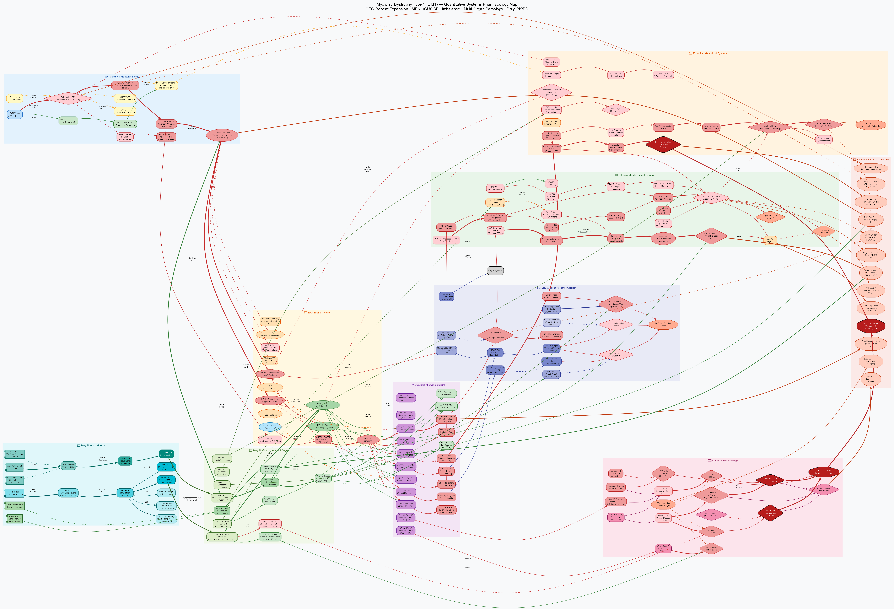

# Myotonic Dystrophy Type 1 (DM1) — QSP Model

> **Directory:** `myotonic-dystrophy/` | **Abbreviation:** DM1 | **Date:** 2026-06-26
> **Category:** Neuromuscular | **OMIM:** #160900

[](dm1_qsp_model_en.svg)

---

## Core Pathophysiology Pathway

```
DMPK Gene (Chr 19q13.32)
  └─► CTG Repeat Expansion (>50 → up to 10,000+ repeats)
        └─► Mutant DMPK mRNA (CUGn) retained in nucleus
              └─► CUGn RNA Hairpin → Nuclear RNA Foci
                    ├─► MBNL1 Sequestration (loss-of-function)
                    └─► PKCβII Activation → CUGBP1/CELF1 Hyperphosphorylation (gain-of-function)
                          │
                          ▼ MBNL1↓ + CUGBP1↑ = Fetal Splicing Program Reversion
                          │
                          ├─► CLCN1 fetal isoform → ClC-1 ↓ → Myotonia
                          ├─► INSR fetal isoform  → Insulin resistance
                          ├─► SERCA1 fetal isoform → Ca²⁺ dysregulation
                          ├─► TNNT2 fetal isoform → Cardiac contractile defect
                          ├─► MAPT 4R/3R imbalance → Tau CNS pathology
                          └─► CAMK2D/KCNQ1 splicing → Arrhythmia risk
```

---

## QSP Model Composition

### Mechanistic Map
- **Node count:** ~158 (10 subgraph clusters)
- **Clusters:** ① genetics/molecular ② RNA-binding proteins ③ alternative splicing ④ skeletal
  muscle ⑤ cardiac ⑥ CNS/cognition ⑦ endocrine/metabolism ⑧ pharmacokinetics ⑨ pharmacodynamics
  ⑩ clinical endpoints

### mrgsolve ODE Model (22 Compartments)

| Compartment | Variable | Description |
|------|--------|------|
| PK-1 | MEX_GUT | Mexiletine gut absorption |
| PK-2 | MEX_CENT | Mexiletine central plasma |
| PK-3 | MEX_PERI | Mexiletine peripheral tissue |
| PK-4 | ASO_PLASMA | ASO plasma concentration |
| PK-5 | ASO_MUSCLE | ASO muscle tissue |
| PK-6 | ASO_NUCL | ASO nuclear concentration (active) |
| BIO-1 | CUG_FOCI | CUG RNA foci burden (0-1) |
| BIO-2 | MBNL1_FREE | Free MBNL1 fraction |
| BIO-3 | CUGBP1_ACT | CUGBP1 activation level |
| BIO-4 | CLCN1_FETAL | CLCN1 fetal-isoform splicing fraction |
| BIO-5 | SERCA_FETAL | SERCA1 fetal-isoform splicing fraction |
| BIO-6 | INSR_FETAL | INSR fetal-isoform splicing fraction |
| END-1 | MYOTONIA | Myotonia VAS score (0-10) |
| END-2 | GRIP_STR | Grip strength (kg) |
| END-3 | MUSCLE_MASS | Skeletal muscle mass (kg) |
| END-4 | PR_INT | PR interval (ms) |
| END-5 | QTc_INT | QTc interval (ms) |
| END-6 | HOMA_IR | HOMA-IR (insulin resistance) |
| END-7 | FVC_PCT | FVC % predicted |

### Treatment Scenarios (7)

| # | Scenario | Administration | Key Target |
|---|----------|------|-----------|
| 1 | Natural history | None | — |
| 2 | Mexiletine 200 mg TID | Oral, every 8 hours | Nav1.4 blockade |
| 3 | Mexiletine 300 mg TID (MELT dose) | Oral, every 8 hours | Nav1.4 blockade |
| 4 | ASO, every 4 weeks (DYNE-101 regimen) | SC/IV every 28 days | CUG RNA degradation |
| 5 | Mexiletine 300 mg + ASO combination | Combination | Nav1.4 + CUG RNA |
| 6 | Gene therapy (AAV-MBNL1, experimental) | Single intramuscular dose | MBNL1 restoration |
| 7 | Severe DM1 (CTG=1200, untreated) | None | Severe natural history |

### Shiny Dashboard (7 Tabs)

| Tab | Contents |
|----|------|
| 1. Patient profile | CTG repeat size, severity classification, initial state |
| 2. Drug PK | Mexiletine plasma concentration, ASO tissue concentration |
| 3. Muscle/myotonia | VAS score, grip strength, Nav1.4/ClC-1 activity |
| 4. Cardiac safety | QTc, PR interval, cardiac risk classification |
| 5. Scenario comparison | Multi-treatment comparison, 1-year outcome table |
| 6. Biomarker panel | CLCN1/INSR/SERCA1 splicing indices |
| 7. CNS/metabolism | HOMA-IR, FVC%, systemic complications |

---

## Key Clinical Trial Calibration

| Clinical Trial | Treatment | Result | Reference |
|---------|------|------|---------|
| Logigian 2010 RCT | Mexiletine 150/200 mg TID | VAS myotonia score −2.6 vs. placebo | Neurology 2010 |
| MELT 2018 | Mexiletine 300 mg TID | Safety confirmed, myotonia improved | Muscle Nerve 2018 |
| Ionis-DMPK-2.5Rx 2015 | ISIS 598769 SC | DMPK mRNA reduced 50–80% | Cunningham 2015 |
| DYNE-101 Ph2 | AOC 1001 IV | CLCN1 splicing index improved ~40pp | 2023 |
| Groh 2008 NEJM | Observational study | HV > 70 ms → 5-fold SCD risk | NEJM 2008 |

---

## File List

| File | Description |
|------|------|
| [`dm1_qsp_model_en.dot`](dm1_qsp_model_en.dot) | Graphviz mechanistic map (~158 nodes, 10 clusters) |
| [`dm1_qsp_model_en.svg`](dm1_qsp_model_en.svg) | Vector-format map (high resolution) |
| [`dm1_qsp_model_en.png`](dm1_qsp_model_en.png) | Raster-format map (150 dpi) |
| [`dm1_mrgsolve_model_en.R`](dm1_mrgsolve_model_en.R) | mrgsolve ODE QSP model (22 compartments, 7 scenarios) |
| [`dm1_shiny_app_en.R`](dm1_shiny_app_en.R) | Shiny interactive dashboard (7 tabs) |
| [`dm1_references_en.md`](dm1_references_en.md) | 40 references (10 sections) |

---

## Usage

```bash
# Render the mechanistic map
dot -Tsvg myotonic-dystrophy/dm1_qsp_model.dot -o myotonic-dystrophy/dm1_qsp_model.svg
dot -Tpng -Gdpi=150 myotonic-dystrophy/dm1_qsp_model.dot -o myotonic-dystrophy/dm1_qsp_model.png
```

```r
# mrgsolve model
install.packages(c("mrgsolve", "dplyr", "ggplot2", "tidyr"))
source("myotonic-dystrophy/dm1_mrgsolve_model.R")

# Shiny dashboard
install.packages(c("shiny", "shinydashboard", "plotly", "DT", "scales"))
shiny::runApp("myotonic-dystrophy/dm1_shiny_app.R")
```

---

## Key Abbreviations

| Abbreviation | Description |
|------|------|
| DMPK | Dystrophia Myotonica Protein Kinase |
| CTG | Cytosine-Thymine-Guanine (trinucleotide repeat) |
| MBNL1 | Muscleblind-Like Protein 1 |
| CUGBP1/CELF1 | CUG-Binding Protein / CELF Family |
| ClC-1 | Chloride Channel 1 (skeletal muscle) |
| Nav1.4 | Voltage-gated Sodium Channel, skeletal muscle |
| INSR | Insulin Receptor |
| SERCA1 | Sarco/Endoplasmic Reticulum Ca²⁺-ATPase 1 |
| ASO | Antisense Oligonucleotide |
| MELT | Mexiletine Evaluation of Toxicity trial |
| EDS | Excessive Daytime Sleepiness |
| HOMA-IR | Homeostatic Model Assessment for Insulin Resistance |
| VAS | Visual Analogue Scale |
| MIRS | Muscular Impairment Rating Scale |
