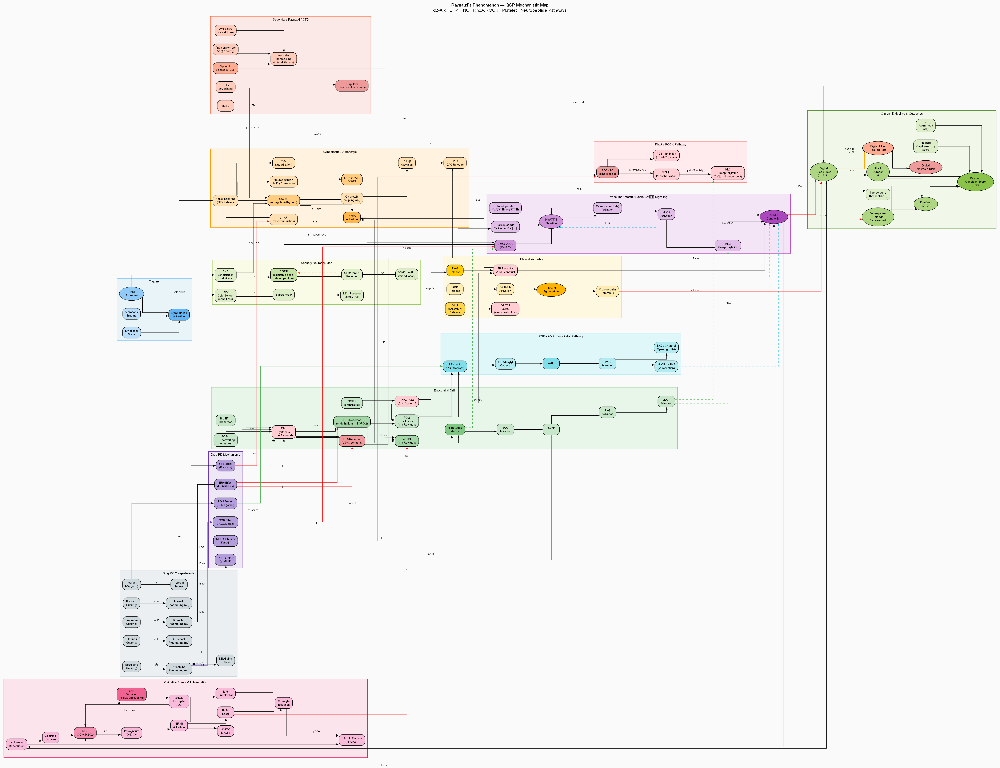

# Raynaud's Phenomenon — QSP Model

> **QSP Disease Model Library** · A quantitative systems pharmacology (QSP) model automatically generated via the Claude Code Routine.
> Parent library → [../README_en.md](../README_en.md) · Category: Vascular/Connective Tissue

[](raynaud_qsp_model_en.svg)

## Overview

Raynaud's phenomenon is intermittent vasospasm of small arteries and arterioles triggered by cold exposure or emotional stress, producing a triphasic colour change (pallor → cyanosis → rubor) in the fingers and toes. It is classified as primary (idiopathic) or secondary (associated with systemic sclerosis, lupus, or MCTD), with a global prevalence of 3-5%. The core mechanisms are α2C-adrenoceptor hypersensitivity, endothelial dysfunction (eNOS↓, ET-1↑, PGI2↓), increased calcium sensitivity via the RhoA/ROCK pathway, and neuropeptide imbalance (CGRP↓, NPY↑), with vascular remodelling and digital ulcers added in the secondary form.

## Key Pathways

| Pathway | Key molecule/mechanism | Clinical outcome |
|------|----------------|-----------|
| α2C-AR activation | Cold → α2C-AR upregulation → NE → vasoconstriction | Vasospastic attack |
| RhoA/ROCK pathway | RhoGEF → RhoA-GTP → ROCK → MYPT1 phosphorylation → MLC phosphorylation (Ca²⁺-independent) | Increased calcium sensitivity, sustained contraction |
| Endothelial NO deficiency | eNOS↓ → NO↓ → sGC/cGMP↓ → MLCP↓ | Impaired vasodilation |
| Endothelin-1 excess | ETA-R → Gq/Gα12 → IP3/RhoA → VSMC contraction | Vasoconstriction + remodelling |
| PGI2 deficiency | COX-2↓ → PGI2↓ → IP-R/cAMP/PKA↓ | Platelet aggregation↑, vasodilation↓ |
| Neuropeptide imbalance | CGRP↓ (blocked by cold), NPY↑ co-release | Loss of neurogenic vasodilation |
| Oxidative stress | NOX2/XO → ROS → NF-κB → ET-1↑, eNOS uncoupling | Vicious-cycle oxidative damage |
| Platelet activation | TXA2↑, 5-HT, ADP → GP IIb/IIIa | Microthrombi, persistent cyanosis |

## Drug Targets

- **Calcium channel blockers (nifedipine, amlodipine)**: L-type VGCC blockade → [Ca²⁺]i↓; first-line therapy
- **PDE5 inhibitors (sildenafil, tadalafil)**: inhibits cGMP breakdown → vasodilation; second-line therapy or for secondary disease
- **Endothelin receptor antagonists (bosentan)**: ETA/ETB blockade → blocks ET-1 effects; for secondary disease and digital ulcer prevention
- **Prostacyclin analogues (iloprost)**: IP receptor agonist → cAMP↑; for severe secondary disease
- **α1-blockers (prazosin)**: α1-AR blockade → sympathetic vasoconstriction↓
- **Others (fluoxetine, losartan)**: indirect vasoactive effects

## Model Files

| File | Description |
|------|------|
| [raynaud_qsp_model_en.dot](raynaud_qsp_model_en.dot) | Graphviz mechanistic map source (100+ nodes / 13 clusters) |
| [raynaud_qsp_model_en.svg](raynaud_qsp_model_en.svg) | SVG vector image (scalable) |
| [raynaud_qsp_model_en.png](raynaud_qsp_model_en.png) | PNG image (150 dpi) |
| [raynaud_mrgsolve_model.R](raynaud_mrgsolve_model.R) | mrgsolve ODE model (18 compartments / 9 scenarios) |
| [raynaud_shiny_app.R](raynaud_shiny_app.R) | Shiny dashboard (7 tabs) |
| [raynaud_references_en.md](raynaud_references_en.md) | References (62 articles, PubMed links) |

## mrgsolve Model (ODE Model)

- **Compartment structure**: 10 PK compartments for nifedipine/sildenafil/bosentan/iloprost/prazosin + 8 PD compartments for NE, RhoA, Cai, cGMP, cAMP, ET-1, ROS, and DBF (18 ODEs total)
- **Key treatment scenarios**: untreated primary disease, nifedipine 30 mg QD, sildenafil 50 mg BID, bosentan 125 mg BID (secondary disease), iloprost IV for 5 days (secondary disease), prazosin 1 mg BID, nifedipine + sildenafil combination, untreated secondary disease (SSc), cold-challenge test
- **Calibration/evidence**: parameters set based on Thompson & Pope, *Rheumatology* 2005 (CCB meta-analysis), Fries et al., *Circulation* 2005 (sildenafil RCT), Matucci-Cerinic et al., *Ann Rheum Dis* 2011 (bosentan RAPIDS-2), and Belch et al., *Ann Rheum Dis* 1995 (iloprost RCT)

## Shiny Dashboard

Comprises 7 tabs: (1) **Patient Profile** — set subtype, α2-AR sensitivity, triggers, and severity; (2) **Drug PK** — time course of blood concentrations for 5 drugs; (3) **Vasoactive Mediators** — dynamics of ET-1, NE, ROS, RhoA; (4) **Vasomotor Response** — digital blood flow, cold-challenge test, attack frequency; (5) **Clinical Endpoints** — RCS, vasospasm frequency, VAS, digital ulcer risk; (6) **Scenario Comparison** — comparative analysis across 9 treatments; (7) **Biomarkers** — correlation of signalling mediators, capillaroscopy index.

## Usage

```r
library(mrgsolve)
mod <- mread("raynaud_mrgsolve_model.R")
out <- mrgsim(mod, end = 2016, delta = 2)
plot(out)
# Shiny dashboard:
shiny::runApp("raynaud_shiny_app.R")
```
```bash
# Render the mechanistic map
dot -Tsvg raynaud_qsp_model_en.dot -o raynaud_qsp_model_en.svg
dot -Tpng -Gdpi=150 raynaud_qsp_model_en.dot -o raynaud_qsp_model_en.png
```

## References

For detailed citations, see [raynaud_references_en.md](raynaud_references_en.md) (62 articles).

---
*This model is a qualitative/semi-quantitative QSP model intended for education and research, and must not be used directly for clinical decision-making.*
