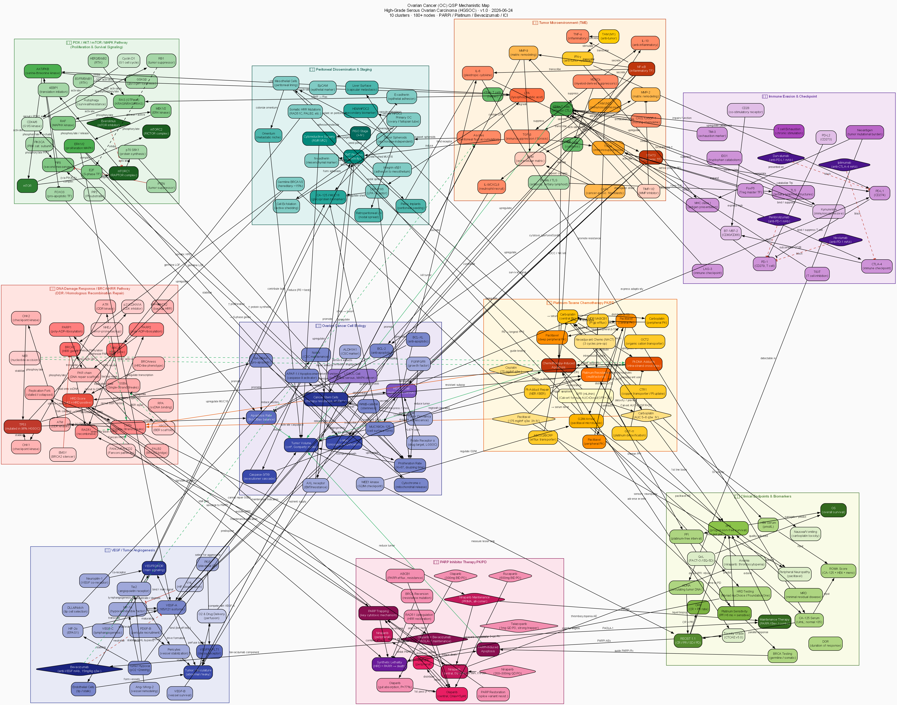

# Ovarian Cancer QSP Model

> **Category**: Gynecologic Oncology | **Abbreviation**: OC (HGSOC) | **Date**: 2026-06-24

[](oc_qsp_model.svg)

---

## Disease Overview

Ovarian cancer is a gynaecologic cancer ranking roughly fifth in cancer deaths among women, with approximately 320,000 diagnoses annually worldwide. The most common and lethal subtype is **High-Grade Serous Ovarian Carcinoma (HGSOC)**, accounting for approximately 70% of all ovarian cancers. HGSOC is defined by the following features:

- **TP53 mutation**: an almost obligatory mutation, found in more than 96% of cases
- **HRD (Homologous Recombination Deficiency)**: found in approximately 50% (BRCA1/2 mutations 15%+7%, plus other HRR gene mutations)
- **Delayed diagnosis**: 70-80% are diagnosed at FIGO stage III/IV
- **Peritoneal metastasis**: tumour cells shed into the peritoneal cavity and implant on the peritoneum/omentum
- **Platinum sensitivity**: responds well to initial treatment, but resistance commonly develops

### Shift in Treatment Paradigm

Following the results of PARP inhibitor trials in 2018-2019 (SOLO-1, PRIMA, PAOLA-1), maintenance therapy became standardised, and stratified treatment based on HRD status has become central to care.

---

## The 10 Key Mechanistic Subsystems

| # | Cluster | Key components |
|---|---------|------------|
| **1** | **DDR/HRR** — BRCA-HRR pathway | BRCA1/2, RAD51, PARP1/2, ATM/ATR, CHK1/2, HRD score, NER, NHEJ |
| **2** | **PI3K/AKT/mTOR** — proliferation/survival | PIK3CA, PTEN, AKT, mTORC1/2, S6K1, ERK, RAS/RAF/MEK, CDK4/6, RB1, E2F |
| **3** | **VEGF/angiogenesis** | HIF-1α, VEGF-A/B/C, VEGFR1/2, endothelial cells, pericytes, DLL4/Notch, bevacizumab |
| **4** | **Tumour microenvironment (TME)** | CAF, TAM (M1/M2), MDSC, NK, CD8+ T, Treg, IL-6, TGF-β, IL-10, MMP-2/9, LPA, STAT3 |
| **5** | **Immune evasion** | PD-L1/PD-1, CTLA-4, IDO1, LAG-3, TIM-3, TIGIT, FoxP3, TLS, pembrolizumab |
| **6** | **Peritoneal metastasis** | Primary tumour, shedding, spheroids, peritoneal cells, omentum, CA-125/MUC16, HE4, EMT, FIGO staging |
| **7** | **Platinum-based chemotherapy PK/PD** | Carboplatin (Calvert AUC), paclitaxel (3-compartment), Pt-DNA adducts, G2/M arrest, MDR1, GST-π |
| **8** | **PARP inhibitor PK/PD** | Olaparib (300mg BID), niraparib (300mg QD), PARP trapping, synthetic lethality, BRCA reversion-mutation resistance |
| **9** | **Tumour growth/cell biology** | Gompertz growth, CSC (ALDH1+), BCL-2/BAX, caspase cascade, Wnt/Notch, c-Myc |
| **10** | **Clinical endpoints** | CA-125, HE4, ROMA, PFS, OS, RECIST 1.1, PFI, ctDNA, HRD testing, BRCA testing |

---

## 18-Compartment ODE Model

| # | Compartment (symbol) | Description |
|---|-----------|------|
| 1 | `CAR_C1` | Carboplatin central compartment |
| 2 | `CAR_C2` | Carboplatin peripheral compartment |
| 3 | `PAC_C1` | Paclitaxel central compartment |
| 4 | `PAC_C2` | Paclitaxel peripheral compartment |
| 5 | `PAC_C3` | Paclitaxel deep peripheral compartment |
| 6 | `OLA_gut` | Olaparib gastrointestinal absorption compartment |
| 7 | `OLA_C1` | Olaparib central compartment (Cmax≈5µM) |
| 8 | `OLA_C2` | Olaparib peripheral compartment |
| 9 | `NIRA_C1` | Niraparib central compartment (t½≈36h) |
| 10 | `NIRA_C2` | Niraparib peripheral compartment |
| 11 | `BEV_C1` | Bevacizumab central compartment |
| 12 | `BEV_C2` | Bevacizumab peripheral compartment |
| 13 | `VEGF` | Free VEGF-A concentration (ng/mL) |
| 14 | `TV` | Tumour volume (cm³, Gompertz model) |
| 15 | `CA125` | Serum CA-125 (U/mL) |
| 16 | `Pt_DNA` | Platinum-DNA adducts (relative value) |
| 17 | `CD8T` | CD8+ T cells (relative value) |
| 18 | `HRD` | PARP inhibitor-induced HRD damage accumulation (0-1) |

---

## Six Treatment Scenarios — 2-Year Simulation

| # | Scenario | Drug | Supporting trial | Indication |
|---|---------|------|------------|--------|
| **S1** | Untreated | — | Natural history | — |
| **S2** | Carboplatin+paclitaxel ×6 cycles | Carbo AUC6 + Pacli 175mg/m² | ICON3 (Parmar 2003 Lancet) | Standard first-line |
| **S3** | Carbo+Pacli+bevacizumab → bevacizumab maintenance | +Bev 15mg/kg q3w | ICON7/GOG218 | High-risk first-line |
| **S4** | Carbo+Pacli → olaparib maintenance | Ola 300mg BID for 2 years | **SOLO-1** (mPFS NR) | **BRCA mutation** |
| **S5** | Carbo+Pacli → niraparib maintenance | Nira 200-300mg QD | **PRIMA** (mPFS 13.8mo HRD+) | **HRD-positive** |
| **S6** | Carbo+Pacli+Bev → olaparib+Bev maintenance | Ola+Bev maint | **PAOLA-1** (mPFS 22.1mo HRD+) | **HRD+, Bev-eligible** |

---

## Key Parameter Calibration

| Parameter | Value | Source |
|---------|-----|------|
| Carboplatin CL | GFR×0.134+0.00571×BW (L/h) | Chatelut 1995 JNCI |
| Paclitaxel CL | 13.2 L/h (non-linear PK) | Gianni 1995 JCO |
| Olaparib t½ | 11.9h (300mg BID) | Doherty 2014 Clin Pharmacokinet |
| Niraparib t½ | 36h (QD dosing) | Sandhu 2013 JCO |
| Bevacizumab t½ | ~20 days (IgG1) | Lu 2008 Cancer Chemother Pharmacol |
| CA-125 t½ | ~23 days (serum half-life) | Rustin 1996 JCO |
| Tumour doubling time | ~60 days (untreated, Gompertz) | Oza 2015 Lancet Oncol |
| SOLO-1 mPFS | NR vs 13.8mo (HR 0.30, BRCA+) | Moore 2018 NEJM |
| PRIMA mPFS | 13.8mo vs 8.2mo (HR 0.43, HRD+) | Gonzalez-Martin 2019 NEJM |
| PAOLA-1 mPFS | 22.1mo vs 16.6mo (HR 0.33, HRD+) | Ray-Coquard 2019 NEJM |

---

## Shiny App Tab Layout

| Tab | Content |
|----|------|
| **① Patient profile** | BRCA status, HRD score, baseline CA-125, GFR, FIGO stage, treatment-eligibility matrix |
| **② Drug PK** | Time-concentration curves for carboplatin, paclitaxel, olaparib, niraparib, bevacizumab |
| **③ PD biomarkers** | CA-125 kinetics, platinum-DNA adducts, HRD damage accumulation, CD8+ T-cell infiltration |
| **④ Tumour response** | Tumour volume Gompertz curve, RECIST classification, best response %, estimated PFS |
| **⑤ Scenario comparison** | Comparison of tumour/CA-125 across 6 treatment scenarios, summary table |
| **⑥ Biomarker panel** | 6-panel composite biomarker view, BRCA/HRD treatment decision tree, reference values from clinical trials |

---

## QSP Model Files

| Component | File | Specification |
|---------|------|------|
| 🗺️ Mechanistic map (DOT) | [`oc_qsp_model.dot`](oc_qsp_model.dot) | **180+ nodes, 10 clusters** (fdp layout) |
| 🖼️ Mechanistic map (SVG) | [`oc_qsp_model.svg`](oc_qsp_model.svg) | Vector image |
| 🖼️ Mechanistic map (PNG) | [`oc_qsp_model.png`](oc_qsp_model.png) | 150 dpi raster image |
| ⚙️ mrgsolve ODE model | [`oc_mrgsolve_model.R`](../../../ovarian-cancer/oc_mrgsolve_model.R) | **18-compartment ODE**, **6 treatment scenarios**, calibrated to SOLO-1/PRIMA/PAOLA-1 |
| 📊 Shiny dashboard | [`oc_shiny_app.R`](../../../ovarian-cancer/oc_shiny_app.R) | **6-tab** interactive dashboard |
| 📚 References | [`oc_references.md`](oc_references.md) | **55 PubMed citations** (14 sections) |

---

## How to Run the Shiny App

```r
# Install required packages
install.packages(c("shiny", "shinydashboard", "mrgsolve", "dplyr",
                   "ggplot2", "tidyr", "DT", "plotly", "patchwork"))

# Run the app
shiny::runApp("ovarian-cancer/oc_shiny_app.R")
```

---

*Ovarian Cancer QSP Model | Ovarian Cancer (HGSOC) QSP | 2026-06-24 | Claude Code Routine*
