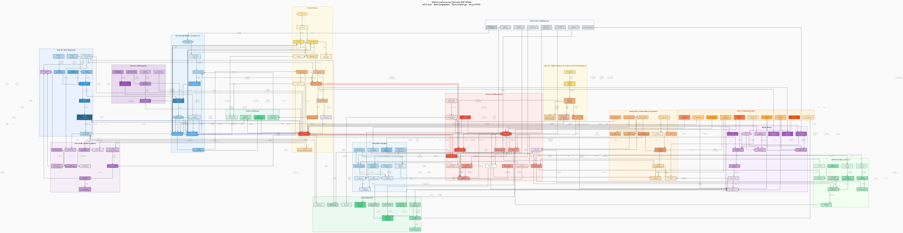

# Uterine Leiomyoma (Fibroid) — Quantitative Systems Pharmacology Model

[](ufl_qsp_model.svg)

---

## Overview

**Disease:** Uterine Leiomyoma (Uterine Fibroids)
**Prevalence:** 70–80% of women of reproductive age (cumulative incidence before age 50)
**Key symptoms:** Heavy menstrual bleeding (HMB), pelvic pain, pelvic pressure, infertility
**Drug targets:** GnRH receptor, estrogen/progesterone receptors, ECM remodelling

---

## Model Components

### Mechanistic Map
Contains interaction pathways across 15 clusters and 120+ nodes:

| Cluster | Content |
|---------|------|
| HPG axis | GnRH → LH/FSH secretion, KNDy neurons, pituitary desensitisation |
| Ovarian steroidogenesis | Cholesterol → E2/P4 biosynthesis (CYP11A1, CYP17A1, CYP19A1) |
| Hormonal feedback | E2/P4 → GnRH negative feedback, inhibin → FSH suppression |
| Uterine biology | Myometrial/endometrial ERα/PR signalling, uterine vascular VEGF |
| Fibroid pathogenesis | MED12 mutation, HMGA2, aromatase overexpression, ECM accumulation |
| Intracellular signalling | MAPK/ERK, PI3K/AKT/mTOR, Wnt/β-catenin, NF-κB |
| ECM remodelling | Collagen I/III, MMP/TIMP balance, LOX cross-linking |
| Inflammation/immunity | M2 macrophages, mast cells, PGE2, COX-2 |
| GnRH agonist PK | Leuprolide depot absorption-distribution-elimination |
| GnRH antagonist PK | Elagolix/relugolix oral PK |
| SPRM PK | Ulipristal acetate (UPA) PK/PD |
| Bone health | BMD, RANKL/OPG, hypoestrogenic bone resorption |
| Clinical endpoints | MBL, PBAC score, haemoglobin, UFS-QoL |
| Other treatments | LNG-IUD, OCP, tranexamic acid, surgery, UAE, MRgFUS |
| Risk factors | Race, age at menarche, nulliparity, obesity, family history |

### mrgsolve ODE Model
**18 ODE compartments:**

| Compartment | Description |
|-----|------|
| GnRH_C | GnRH pulse concentration |
| LH_C, FSH_C | Luteinising/follicle-stimulating hormone |
| E2_C, P4_C | Estradiol, progesterone |
| V_fib, ECM_fib | Fibroid volume (cellular + ECM) |
| MBL_cum | Menstrual blood loss per cycle |
| Hgb_C | Haemoglobin |
| BMD_C | Bone mineral density (normalised) |
| Leu_depot/plasma | Leuprolide depot PK |
| Ela_gut/plasma | Elagolix oral PK |
| Rel_gut/plasma | Relugolix oral PK |
| UPA_gut/plasma | UPA oral PK |

### Treatment Scenarios (6 Scenarios)

| Scenario | Treatment | Clinical trial basis |
|---------|------|-------------|
| S1 | No treatment (natural course) | — |
| S2 | Leuprolide 3.75 mg depot (q4w, 24 weeks) | Friedman 1989 Fertil Steril |
| S3 | Elagolix 150 mg BID (24 weeks) | ELARIS UF-I, Simon 2020 NEJM |
| S4 | Elagolix 200 mg BID + hormonal add-back | ELARIS UF-I/II, Simon/Schlaff NEJM 2020 |
| S5 | Relugolix combination therapy (40 mg + E2/NETA) QD | LIBERTY 1, Lukes 2021 NEJM |
| S6 | Ulipristal acetate 5 mg QD (13 weeks × 2 courses) | PEARL I/II, Donnez 2012 NEJM |

---

## Key Clinical Trial Results

| Trial | Drug | Primary endpoint response rate | Reference |
|---------|------|-------------------|---------|
| ELARIS UF-I | Elagolix 200 mg BID+AB | **68.5%** (Week 24) | Simon JA, NEJM 2020;382:328 |
| ELARIS UF-II | Elagolix 200 mg BID+AB | **76.5%** (Week 24) | Schlaff WD, NEJM 2020;382:317 |
| LIBERTY 1 | Relugolix combination | **71.2%** (Week 24) | Lukes AS, NEJM 2021;384:630 |
| LIBERTY 2 | Relugolix combination | **70.6%** (Week 24) | Al-Hendy A, NEJM 2021;384:630 |
| PRIMROSE 1 | Linzagolix 200 mg+AB | **93.9%** (Week 24) | Murji A, NEJM 2022;387:1767 |
| PEARL I | UPA 5 mg × 13 wk | **91%** controlled bleeding | Donnez J, NEJM 2012;366:409 |

*Primary endpoint: menstrual blood loss < 80 mL/cycle (HMB definition) AND ≥ 50% reduction*

---

## Key Pharmacokinetic Parameters

| Drug | Dose | t½ | Bioavailability | Tmax |
|-----|------|----|---------|------|
| Leuprolide depot | 3.75 mg Q4W | 3–4 weeks (depot) | ~95% | 3–4 weeks (sustained) |
| Elagolix | 150/200 mg BID | 4–6 h | 56% | ~1 h |
| Relugolix | 40 mg QD | ~60 h | 12% | ~2 h |
| UPA | 5 mg QD | 32–38 h | 87% | ~1 h |

---

## Shiny App Tabs

| Tab | Content |
|----|------|
| ① Patient profile | Initial parameters, risk-factor matrix, treatment decision guide |
| ② Drug PK | Plasma drug concentration-time plots, PK parameter table |
| ③ Key PD markers | E2, P4, LH/FSH, fibroid volume kinetics |
| ④ Clinical endpoints | MBL, haemoglobin, BMD, hot-flash score |
| ⑤ Scenario comparison | Comparison plots & summary table across all 6 treatment scenarios |
| ⑥ Biomarker panel | Clinical trial results, PBAC score, treatment response indices |

---

## Files

| File | Description |
|------|------|
| `ufl_qsp_model.dot` | Graphviz mechanistic map source |
| `ufl_qsp_model.svg` | Mechanistic map SVG (vector, high resolution) |
| `ufl_qsp_model.png` | Mechanistic map PNG (150 dpi) |
| `ufl_mrgsolve_model.R` | mrgsolve ODE model + 6 treatment scenarios + visualisation |
| `ufl_shiny_app.R` | Shiny interactive dashboard (6 tabs) |
| `ufl_references.md` | 60 references (with PubMed links) |
| `README.md` | This file |

---

## How to Run

```r
# Run the mrgsolve model
source("ufl_mrgsolve_model.R")

# Run the Shiny app
shiny::runApp("ufl_shiny_app.R")
```

### Required R Packages

```r
install.packages(c("mrgsolve", "ggplot2", "dplyr", "tidyr",
                   "shiny", "shinydashboard", "plotly", "DT"))
```

---

## Disease Overview

### Core Pathogenesis

```
HPG axis activation
    ↓
E2 (estradiol) / P4 (progesterone) secretion
    ↓
Myometrial ERα/PR overexpression (MED12/HMGA2 mutation)
    ↓
Cell proliferation ↑ (MAPK/ERK, PI3K/AKT, Wnt/β-catenin)
+ ECM accumulation ↑ (TGF-β → collagen I/III)
+ Aromatase overexpression → local E2 production (positive feedback)
    ↓
Uterine fibroid formation and growth
    ↓
AUB (heavy menstrual bleeding) + pelvic pain + pelvic pressure
    ↓
Iron-deficiency anaemia + infertility + reduced quality of life
```

### GnRH Antagonist vs Agonist Comparison

| Feature | GnRH agonist (leuprolide) | GnRH antagonist (elagolix/relugolix) |
|-----|------------------------|--------------------------------|
| Mechanism | Pituitary GnRHR downregulation (sustained exposure) | Competitive GnRHR blockade (immediate) |
| Initial response | Flare effect, 1–2 weeks | Immediate suppression (no flare) |
| Onset of LH/FSH suppression | Suppressed after 2–4 weeks | Suppressed within days |
| Route of administration | Injection (depot) | Oral |
| Reversibility | Full recovery (3–6 months after discontinuation) | Rapid recovery (short t½) |
| Need for hormonal add-back | Needed beyond 6 months | Needed for long-term treatment |

---

*Model created: 2026-06-25 | QSP Library CCR Auto-generated*
*References: 60 | Compartments: 18 ODE | Shiny tabs: 6*
